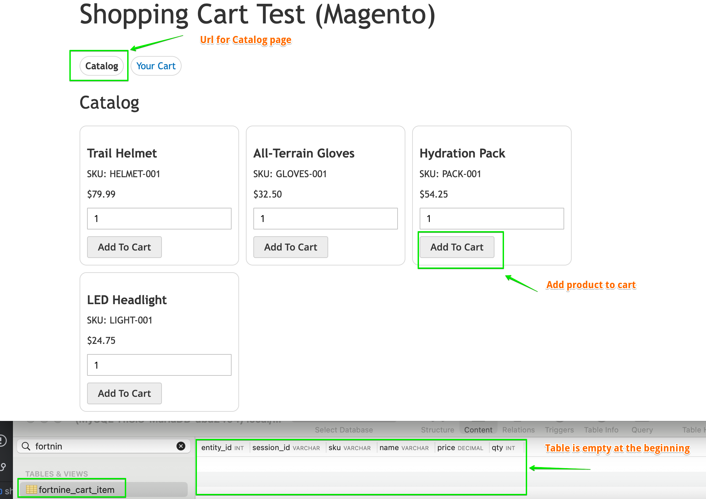
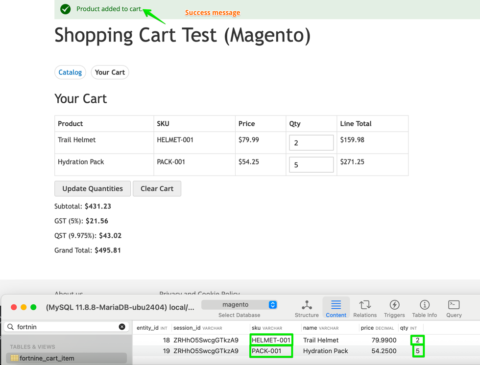
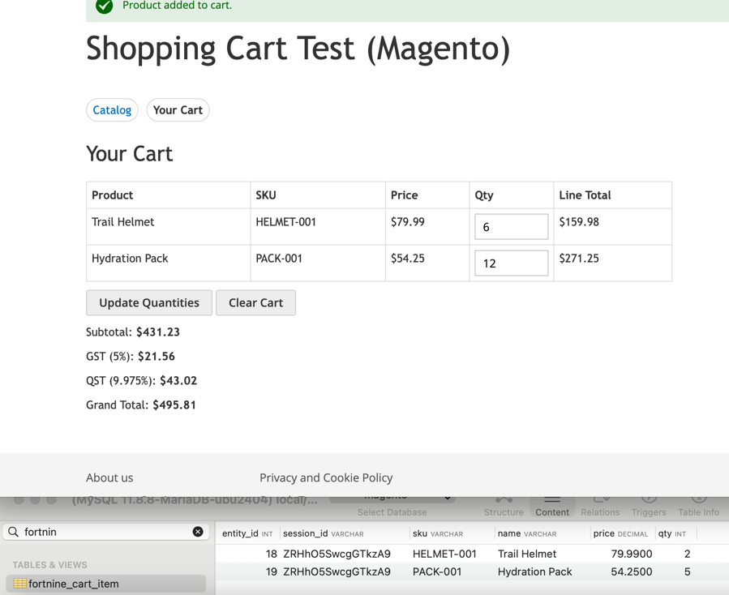
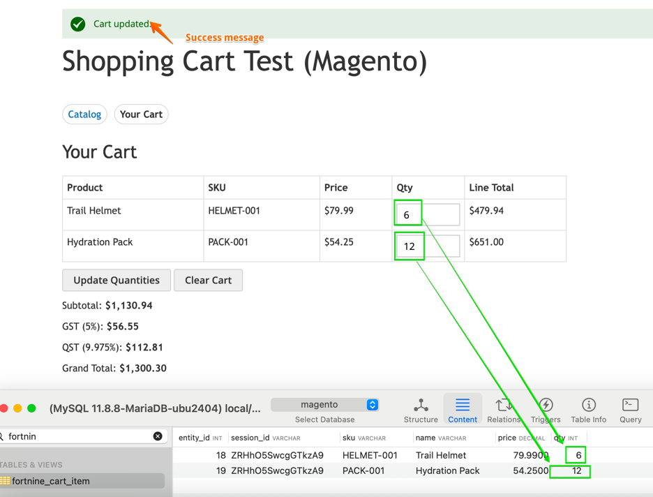
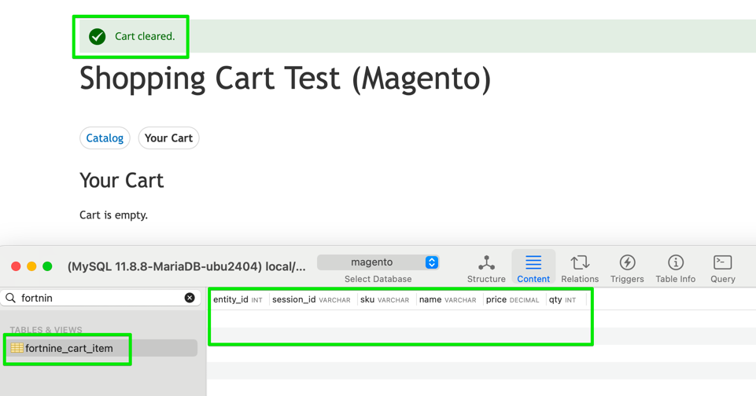

# Magento Version

This folder contains a Magento 2 module implementation:

- Module: `FortNine_ShoppingCartTest`
- Path: `app/code/FortNine/ShoppingCartTest`

## Features

- Custom catalog can be found page at `/shoppingcarttest/cart/index`
- Custom cart can be found page at `/shoppingcarttest/cart/view`
- Add products to cart, update quantities, clear cart
- Cart data persisted in database table `fortnine_cart_item`
- Cart summary with subtotal, GST, QST, grand total
- Unit tests for module domain logic

## Installation

1. Copy module into Magento root at:
    - `app/code/FortNine/ShoppingCartTest`
2. Run Magento setup commands:
    - `bin/magento module:enable FortNine_ShoppingCartTest`
    - `bin/magento setup:upgrade`
    - `bin/magento setup:di:compile`
    - `bin/magento setup:static-content:deploy -f`
    - `bin/magento cache:flush`
3. Open:
    - `/shoppingcarttest/cart/index`

## Unit Tests

In Magento root, run:

- `vendor/bin/phpunit app/code/FortNine/ShoppingCartTest/Test/Unit`

## Tools Used

- Magento 2
- PHP 8+
- MySQL (via Magento)
- PHPUnit
- GitHub Copilot
- PHPStorm
- Sequel Ace

## Online Demo

Deploy this module on a public Magento environment and expose `/shoppingcarttest/cart/index`.

## Used Magento oinstallation with Docker

To configure Docker for current project, following information was used:
https://github.com/markshust/docker-magento#setup
- 
```
# Create your project directory then go into it:
mkdir -p ~/Sites/magento
cd $_

# Run this automated one-liner from the directory you want to install your project.
curl -s https://raw.githubusercontent.com/markshust/docker-magento/master/lib/onelinesetup | bash -s -- magento.test community 2.4.8-p5
```

##  Demo result locally
1. Go to page `/shoppingcarttest/cart/index` to see the Catalog page emulation. 
   
   Note: cart page is empty and table `fortnine_cart_item` is empty.

   
2. Add any product(s) with any quontytyt > 0 to cart.
   (Example: add Trail Helmet - 2,  see Cart, back to Catalog page (press Url for Catalog page) and add Hydration Pack - 5)
   
   
3. Update Qty for each product in cart.
   Select new Qty for products and press button "Update Quantities"

   

   

   
4. Press button "Clear Cart"
   
